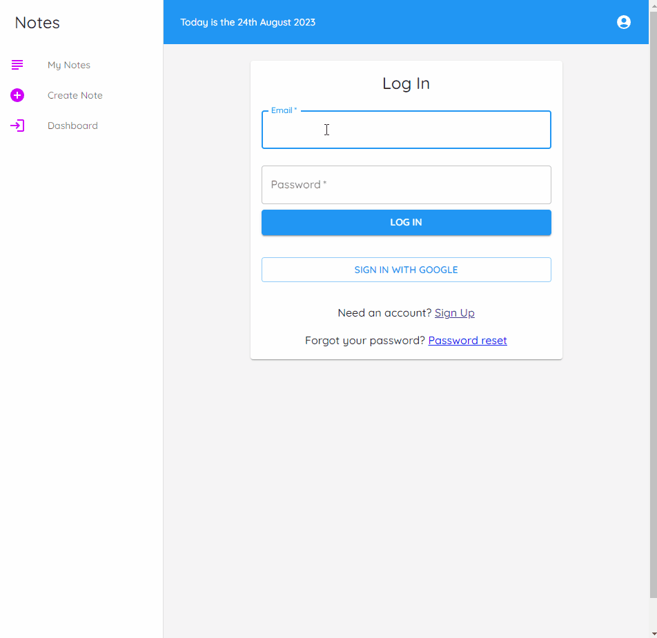

# Typenotes

Typenotes is a simple note-taking web application that helps you organize your thoughts and tasks efficiently.

## Table of Contents

- [Features](#features)
- [Technologies Used](#technologies-used)
- [Getting Started](#getting-started)
- [Usage](#usage)
- [Contributing](#contributing)
- [License](#license)
- [Contact](#contact)
- [Project Status](#project-status)

## Features

- Login: This feature allows users to create an account and log in to the application. It's essential for securing user data and providing a personalized experience.
- Create, Edit, and Delete Notes: Users can create new notes, edit existing ones, and delete notes they no longer need. This is a core functionality for a note-taking application.
- Organize Notes into Categories or Tags: This feature enables users to categorize their notes, making it easier to find and manage them. Categories or tags can help users stay organized, especially when they have a large number of notes.
- User-friendly and Intuitive Interface: A user-friendly and intuitive interface is crucial for a positive user experience. It should be easy to navigate, and users should be able to perform actions without confusion.
- Mobile-Responsive Design: A mobile-responsive design ensures that the application works well on various devices, including smartphones and tablets. It adapts to different screen sizes and resolutions, making it accessible on the go.

## Preview

## Technologies Used

- **General**: project created in Vite
- **Frontend**: TypeScript, Styled Components, Material UI, React
- **State Management**: TanStack Query v4, React-Query
- **Routing**: React-Router-Dom v6
- **Backend**: Firebase
- **Custom Hooks**: React custom hooks for enhanced functionality

## Getting Started

Follow these steps to set up and run Typenotes on your local machine:

1. Clone the repository: git clone https://github.com/GrzegorzPacewicz/typenotes
2. Navigate to the project directory: cd typenotes
3. Install dependencies: npm install
4. Start the development server: npm start
5. Open your browser and navigate to `http://localhost:3000` to access Typenotes.

## Usage

1. Register an account or log in if you already have one.
2. Create a new note by clicking the "New Note" button.
3. Edit notes by clicking on them. Save your changes.
4. Delete notes using the delete option within a note.
5. Organize notes by assigning categories or tags.

## Demo

The application is available at: [https://grzegorz-notes.web.app/](https://grzegorz-notes.web.app/)

## Contributing

We welcome contributions from the community! If you'd like to contribute, please follow these steps:

1. Fork the repository.
2. Create a new branch for your feature or bug fix.
3. Make your changes and commit them with descriptive messages.
4. Push your changes to your fork.
5. Submit a pull request to the `main` branch of the original repository.

Please ensure that your code follows our coding standards and is adequately tested.

## License

This project is licensed under the MIT License. See the [LICENSE](https://opensource.org/license/mit/) file for details.

## Contact

For questions or suggestions, feel free to reach out to us at g.pacewicz@gmail.com.

## Project Status

Typenotes is actively maintained and open for contributions.
